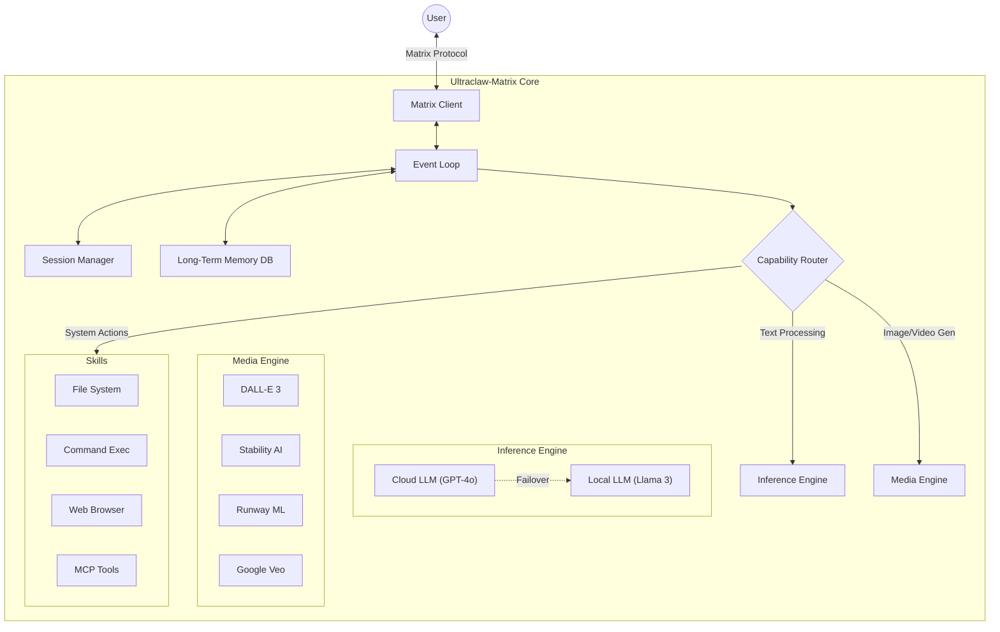
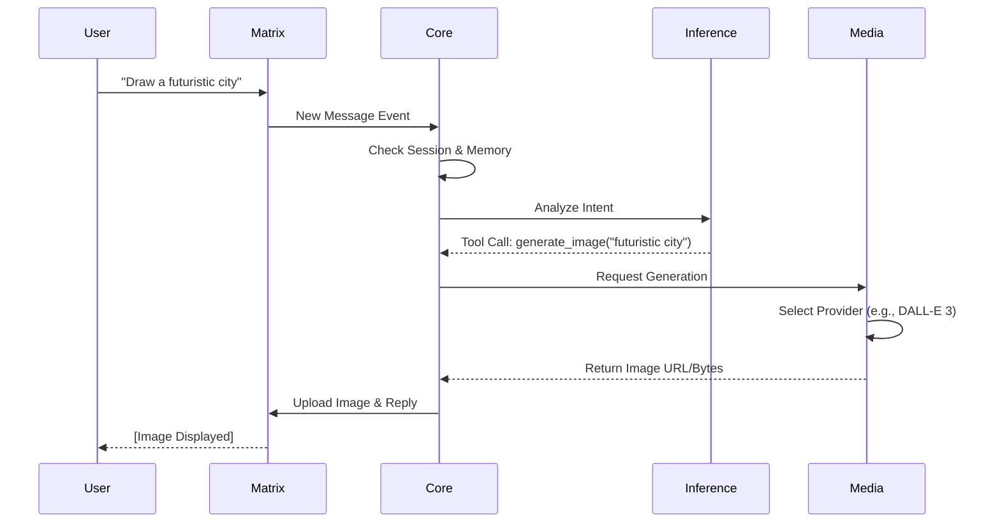
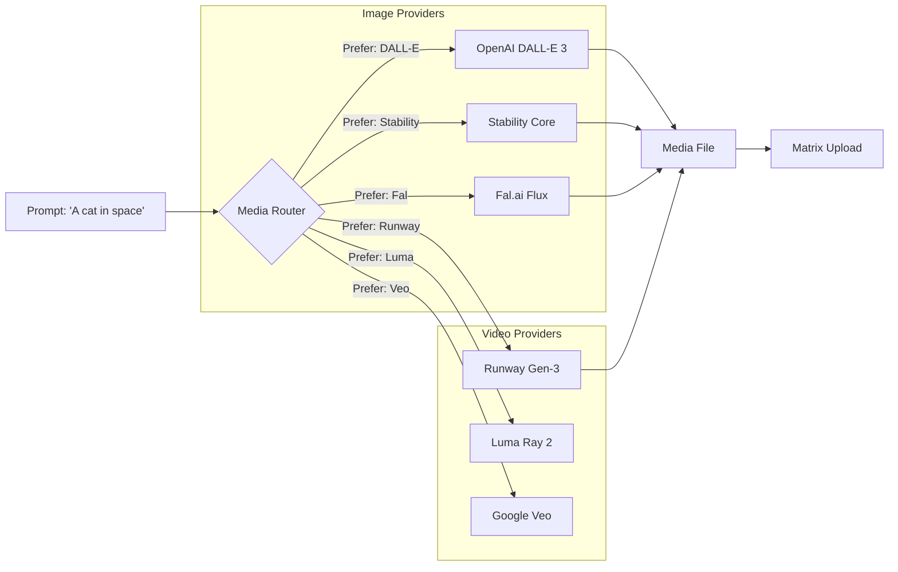

# Ultraclaw-Matrix 🦀


**Ultraclaw-Matrix** is a hyper-optimized, multimodal autonomous AI agent built in Rust. It bridges the gap between local high-performance inference and cloud-based creativity, living natively on the [Matrix](https://matrix.org/) network.

---

## 🏗️ System Architecture

Ultraclaw-Matrix functions as a highly modular "Brain" that connects to the world via the Matrix protocol. Its core is an async event loop that processes messages, manages state, and dispatches tasks to specialized engines.



### 🌊 Message Flow: From User to Agent

How Ultraclaw-Matrix processes a single message:



---

## 🛠️ Installation Guide

Follow these steps to get Ultraclaw-Matrix running on your machine.

### Prerequisites

| OS | Requirement | Command to Install |
|---|---|---|
| **All** | **Rust** (Stable) | `curl --proto '=https' --tlsv1.2 -sSf https://sh.rustup.rs | sh` |
| **All** | **Git** | [Download Git](https://git-scm.com/downloads) |
| **Windows** | **C++ Build Tools** | Install [Visual Studio Build Tools](https://visualstudio.microsoft.com/visual-cpp-build-tools/) |
| **Linux (Ubuntu/Debian)** | **Build Essentials** | `sudo apt install build-essential libssl-dev pkg-config libsqlite3-dev` |
| **macOS** | **Xcode Command Line Tools** | `xcode-select --install` |

### Step 1: Clone the Repository
```bash
git clone https://github.com/nishal21/Ultraclaw-Matrix.git
cd Ultraclaw-Matrix
```

### Step 2: Compile the Binary
Running in release mode ensures maximum performance.
```bash
cargo build --release
```
*   The first build may take a few minutes as it downloads dependencies.
*   The binary will be located at:
    *   **Windows**: `target\release\Ultraclaw-Matrix.exe`
    *   **Linux/macOS**: `target/release/Ultraclaw-Matrix`

### Step 3: Run the Onboarding Wizard
We've built an interactive setup tool to make configuration easy.

```bash
cargo run -- --init
```

This wizard will guide you through:
1.  **Matrix Setup**: Enter your Homeserver URL (e.g., `https://matrix.org`), Username, and Password.
2.  **LLM Selection**: Choose **Cloud** (OpenAI/Anthropic) or **Local** (Ollama/LocalAI).
3.  **Media Setup**: Enter API keys for services like Stability AI, Runway, Google Veo, etc.

Configuration is saved to `config.json` in the current directory.

Configuration is saved to `config.json` in the current directory.

---

## 🎮 Usage & Functionality

Ultraclaw-Matrix is a **Natural Language Agent**. You don't run commands; you just talk to it.

### Core Capabilities
*   **Chat**: "Who are you?", "Explain quantum physics."
*   **Memory**: "Remember that I like Python.", "What did I tell you about my preferences?"
*   **System Tools**:
    *   "List files in the current directory."
    *   "Read the contents of README.md."
    *   "Run `echo hello` in the shell." (Requires confirmation)

### 🎨 Media Generation
Just ask for what you want. Ultraclaw-Matrix intelligently selects the best provider.

*   **Image**: "Generate a cyberpunk street scene." (Uses DALL-E 3, Stability, or Fal)
*   **Video**: "Create a 5-second video of a drone flying over a mountain." (Uses Runway, Veo, or Luma)

### CLI Commands
*   `cargo run -- --init`: Launch the interactive setup wizard.
*   `cargo run`: Start the agent normally.

---

## ⚙️ Configuration Reference

Ultraclaw-Matrix uses a hierarchy for configuration:
`Env Vars` > `config.json` > `.env file` > `Defaults`

| Category | Variable | Description | Default |
|---|---|---|---|
| **Matrix** | `Ultraclaw-Matrix_HOMESERVER_URL` | URL of your Matrix server | `https://matrix.org` |
| | `Ultraclaw-Matrix_MATRIX_USER` | Your full user ID | e.g. `@bot:matrix.org` |
| | `Ultraclaw-Matrix_MATRIX_PASSWORD` | Your login password | - |
| **Cloud AI** | `Ultraclaw-Matrix_CLOUD_API_KEY` | Key for OpenAI/Anthropic/etc | - |
| | `Ultraclaw-Matrix_CLOUD_MODEL` | Model ID to use | `gpt-4o-mini` |
| **Local AI** | `Ultraclaw-Matrix_CLOUD_BASE_URL` | Base URL for local inference | `http://localhost:11434/v1` |
| | `Ultraclaw-Matrix_CLOUD_MODEL` | Local model name | `llama3` |
| **Media** | `Ultraclaw-Matrix_STABILITY_API_KEY` | Stability AI Key | - |
| | `Ultraclaw-Matrix_RUNWAY_API_KEY` | Runway ML Key | - |
| | `Ultraclaw-Matrix_VEO_API_KEY` | Google Key (VideoFX) | - |
| | ...and many more | See `.env.example` | - |

---

## 🖼️ Media Pipeline

Ultraclaw-Matrix supports **15+ generation providers**. It automatically routes requests based on your configured API keys and preferred provider settings.



---

## 🔗 Integrations (WhatsApp, Discord, etc.)

Ultraclaw-Matrix uses **Matrix Bridges** to talk to other apps. It sees everything as a Matrix room.

### Method 1: Using a Hosted Provider (Easiest)
Use a service like **Beeper** or **Element One** to manage the bridges for you.

1.  **Sign Up**: Create an account on [Beeper.com](https://www.beeper.com/) or similar.
2.  **Connect Networks**: In the Beeper app, connect your WhatsApp, Discord, Telegram, etc.
3.  **Get Credentials**:
    *   You need your Matrix username (e.g., `@user:beeper.com`) and an **Access Token** (or password).
    *   *Tip: Use a dedicated "bot" account if possible, or log Ultraclaw-Matrix in as you.*
4.  **Configure Ultraclaw-Matrix**:
    ```bash
    cargo run -- --init
    ```
    *   **Homeserver**: `https://matrix.beeper.com` (or your provider's URL)
    *   **Username**: `@your_username:beeper.com`
    *   **Password/Token**: Your login credentials.

Ultraclaw-Matrix will now see every chat in your Beeper inbox and can reply to them!

### Method 2: Self-Hosted (Advanced)
If you run your own Matrix server (Synapse), you must install the bridges yourself.

1.  **Install Synapse**: Follow the [Matrix Synapse Guide](https://matrix-org.github.io/synapse/latest/setup/installation.html).
2.  **Install Bridges**:
    *   **WhatsApp**: [`mautrix-whatsapp`](https://github.com/mautrix/whatsapp) - `go install go.mau.fi/mautrix-whatsapp`
    *   **Discord**: [`mautrix-discord`](https://github.com/mautrix/discord)
3.  **Configure Bridge**:
    *   Edit `config.yaml` for the bridge.
    *   Generate `registration.yaml`.
    *   Add registration to Synapse's `homeserver.yaml`.
    *   Restart Synapse.
4.  **Log In**:
    *   Start a chat with the bridge bot (e.g., `@whatsappbot:yourserver.com`).
    *   Scan the QR code to link your WhatsApp.
5.  **Connect Ultraclaw-Matrix**: Point Ultraclaw-Matrix to your local homeserver (`http://localhost:8008`).

Once bridged, Ultraclaw-Matrix treats the bridged chats exactly like native Matrix rooms.

---

## 🤝 Contributing

We welcome contributions! Please check [CONTRIBUTING.md](CONTRIBUTING.md) for details.

1.  Fork the repo.
2.  Create a feature branch (`git checkout -b feature/amazing-feature`).
3.  Commit your changes (`git commit -m 'Add amazing feature'`).
4.  Push to the branch (`git push origin feature/amazing-feature`).
5.  Open a Pull Request.

---

## 📄 License

This project is licensed under the [MIT License](LICENSE).

---

Built with 🦀 and ❤️ by **Nishal**.
